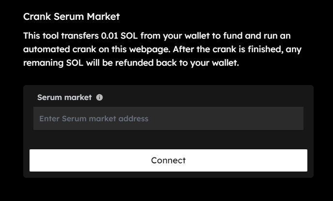

# 🛠 Crank Market

If you're experiencing issues with local response times to specific Serum-based markets, you can access the following 'crank' tool provided by Atrix Finance\
\
[**https://app.atrix.finance/crank**](https://app.atrix.finance/crank)

<figure><figcaption></figcaption></figure>

As mentioned in the graphic, this tool transfers 0.01 SOL from your wallet to fund and run an automated crank on this webpage. After the crank is finished, any remaining SOL will be refunded back to your wallet.

### **What is crank turning?**

On the Serum Orderbooks, the job of matching orders is often referred to as “**crank turning**”. \
The primary groups responsible for ensuring that cranks are turned promptly are **nodes**.

A node is a collection of SRM staking together, including at least one MSRM. \
Nodes manage much of the Serum ecosystem. Since nodes handle cranking, users interested in adding their own markets only have to bring their own liquidity.

Those who pay blockchain transaction fees to turn this crank will be compensated such that doing so is worthwhile.\
\
If you ever find your funds stuck, you can use the tool to retrieve them.
